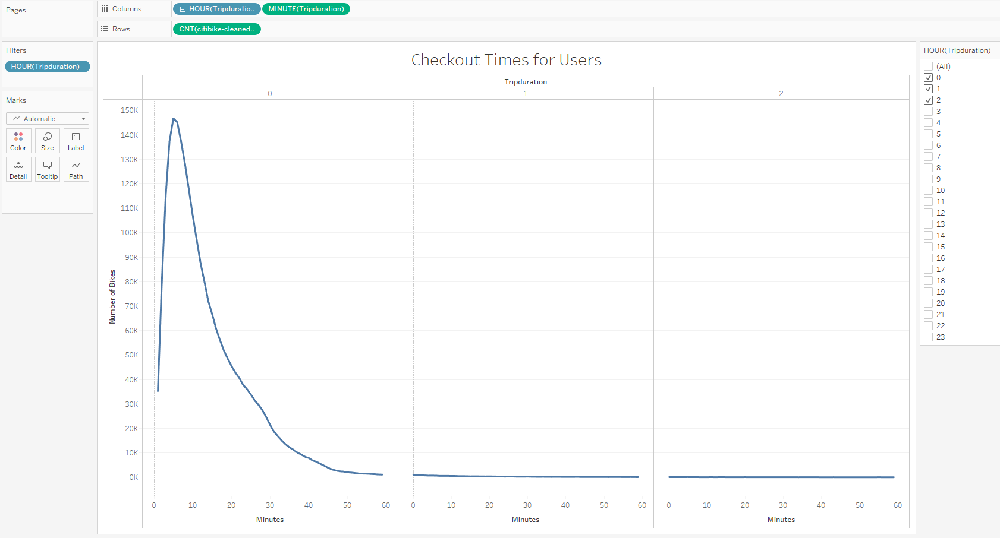
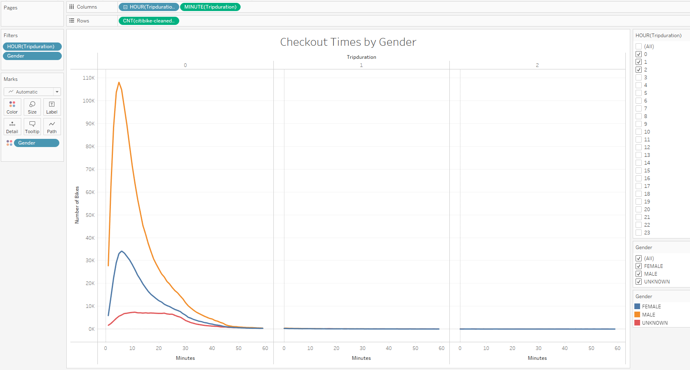
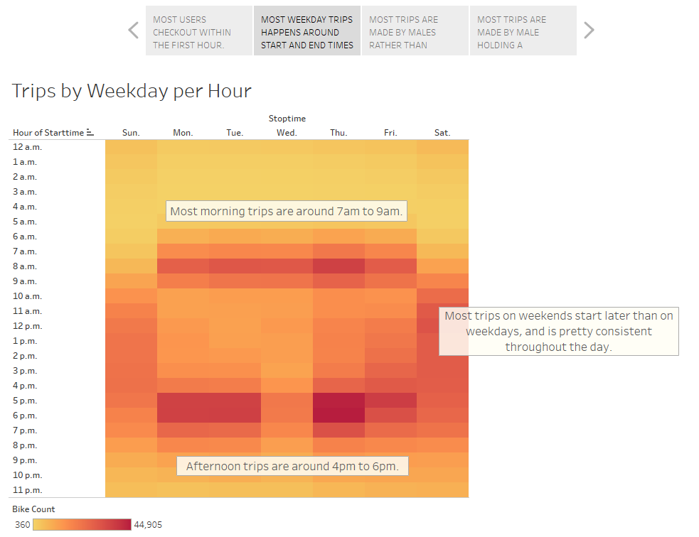
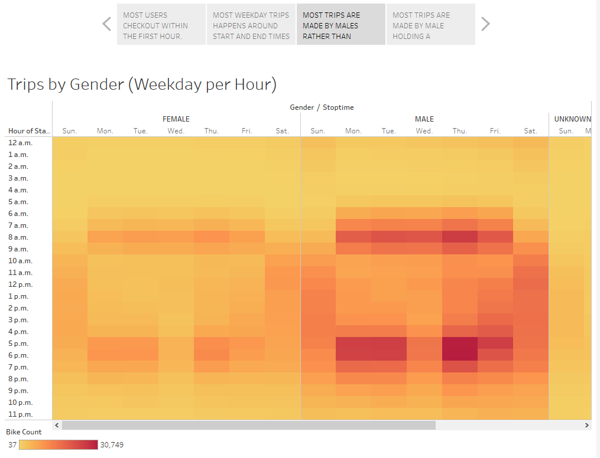
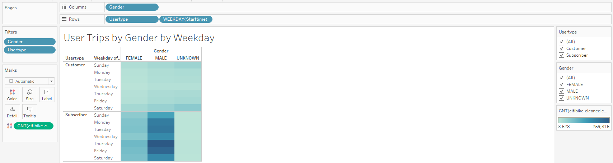
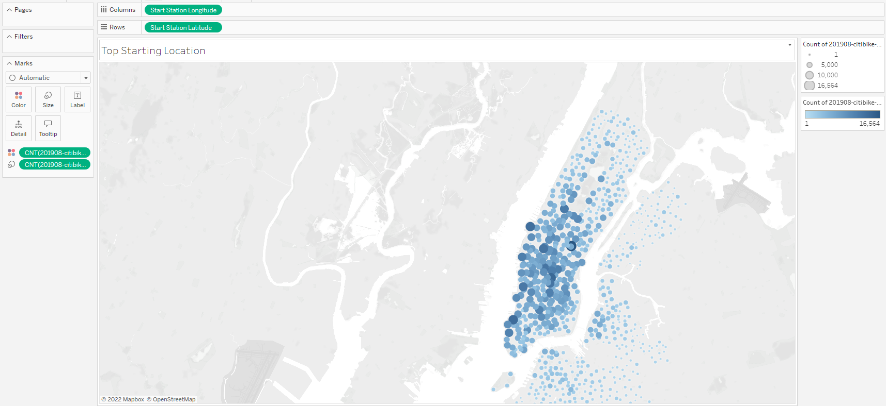
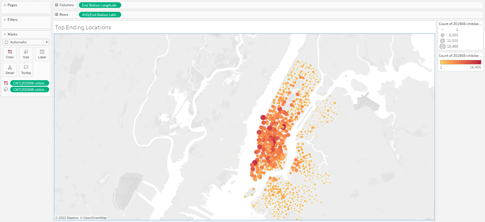
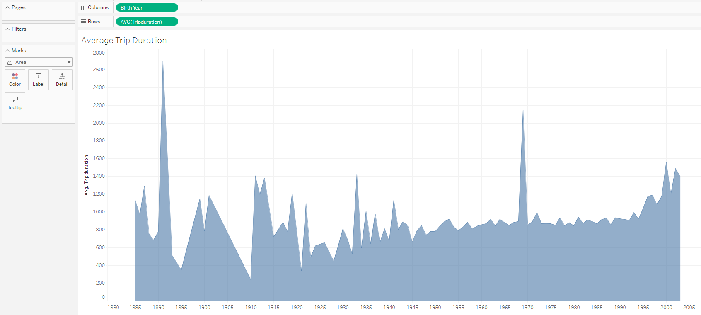
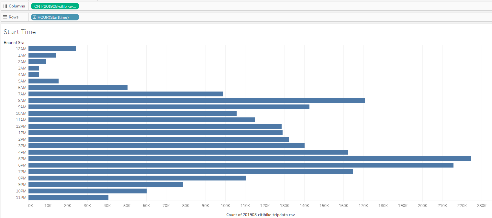

# NYC Citibike Analysis

## Overview & Purpose of the Analysis
The purpose of this statistical analysis is to use Tableau, which is one of the most popular data visualisation tools on the market, to craft a story and presentation for potential investors of NYC Citibike, a bike-sharing company. For this business proposal, we are using 2019 August data from NYC Citibike dataset found [here.](https://s3.amazonaws.com/tripdata/201908-citibike-tripdata.csv.zip)

And here is the [link to my public Tableau, containing my worksheets, dashboard and story.](https://public.tableau.com/views/Challenge15-NYC_Citibike/NYCCitibike?:language=en-US&:display_count=n&:origin=viz_share_link "link to dashboard")

## Results
1. We notice that most of the Citibike users checkout within the first hour of their trips, as shown below:

2. Male users are predominantly higher than other genders.

3. Most weekday trips happen during the start and end hours of a regular working hour schedule, while weekend trips start later in the day, and stays pretty soncistent throughout the day.

4. Most trips during weekdays peak hours are more Male than other genders.

5. Finally, most users are Subscribers rather than customers and mainly Male.

6. [additional] The starting points of the trips are mostly located in the south west of the island, and mostly along the river.

7. [additional] The ending points of the trips are also very closely related to where the trip started on the island, which tells me that the distances travelled are short (understandably for bike riders) and very contained to the south west of the island as well.

## Summary
Most NYC Citibike users in August 2019 were Male and are on a subscription basis, but not a customer. We note peak times (before working hours and after working hours) that most trips happen, and are around the south-west of the island, mostly along the river bend. 

* For future analysis, we could use more months data to see if there is a trend between birth year and trip length, since for the month of August, we did note that the later the birth year, the longer the ride duration - younger crowd seems to be using the bikes for longer trips.

* Another future consideration would be bike repair time, would need to be around down times. Based only on the data for 2019 August, down times are after midnight to 4AM. This might be hard to get workers at this time of the day, so we would need more data to get a better understanding and time.

